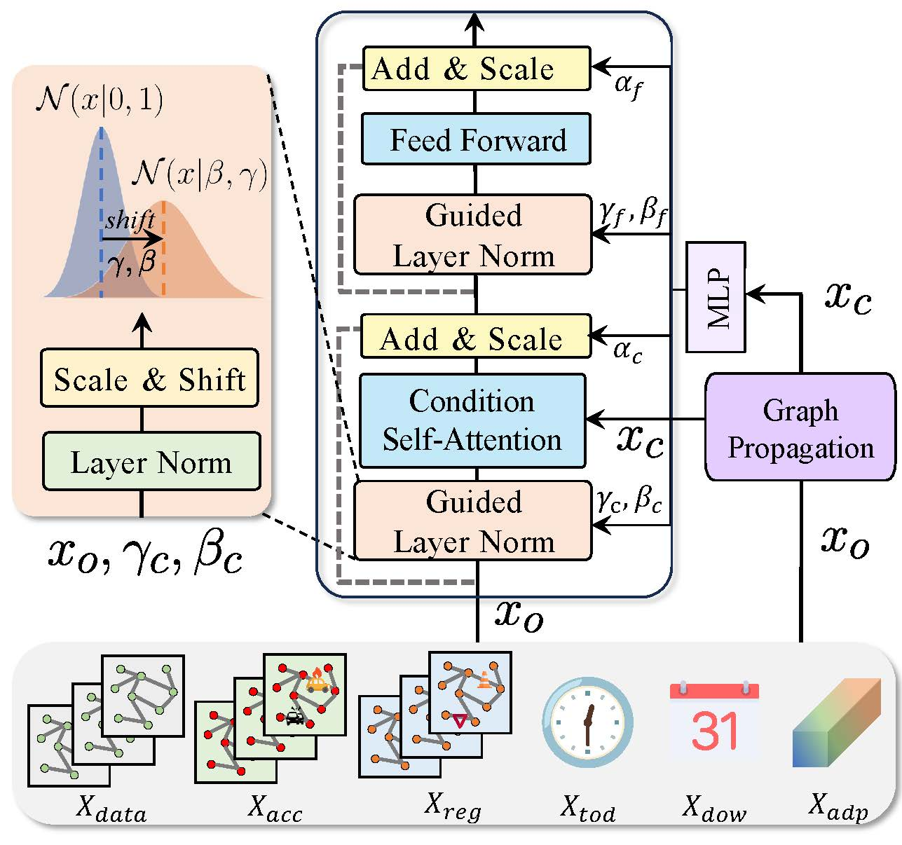

# <div align="center">**Towards Resilient Transportation: A Conditional Transformer for Accident-Informed Traffic Forecasting**</div>

> **Accepted to KDD 2026**

## Abstract

Traffic prediction remains a fundamental challenge in spatiotemporal data mining, with a critical yet underexplored dimension: modeling the disruptive impact of accidents. While existing approaches excel at capturing recurring patterns, they falter when confronted with the non-stationary perturbations induced by traffic accidents, which create distinctive directional shockwaves through transportation networks. We propose ConFormer (Conditional Transformer), which addresses this limitation through two key innovations: 1) an accident-aware graph propagation mechanism that models how disruptions spread asymmetrically through traffic networks, and 2) Guided Layer Normalization (GLN) that dynamically modulates internal representations based on traffic conditions. We contribute two enriched large-scale benchmark datasets from Tokyo and California highways with detailed accident annotations. Theoretically, we establish how GLN enables adaptive feature transformations through condition-dependent affine parameters, allowing ConFormer to maintain coherent representations across both normal and accident-induced states. Empirically, ConFormer consistently outperforms state-of-the-art models, with improvements of up to 10.7\% in accident scenarios, demonstrating that explicitly modeling directional accident propagation substantially enhances predictive performance in complex traffic networks.

## Framework Overview

<div align="center">
  
</div>


## Features

- **Accident-Aware Graph Propagation**: Models how traffic disruptions spread asymmetrically through transportation networks
- **Guided Layer Normalization (GLN)**: Dynamically modulates internal representations based on traffic conditions
- **Dynamic Path Discovery**: Automatically discovers influential paths in the traffic network
- **Multi-scale Temporal Modeling**: Captures both short-term and long-term traffic patterns
- **Comprehensive Embeddings**: Supports time-of-day, day-of-week, accident, and regional embeddings

## Installation

### Requirements

- Python >= 3.7
- PyTorch >= 1.8.0
- NumPy
- Pandas
- PyYAML
- Matplotlib
- torchinfo

### Setup

```bash
# Clone the repository
git clone <repository-url>
cd conformer

# Install dependencies
pip install torch numpy pandas pyyaml matplotlib torchinfo
```

## Project Structure

```
conformer/
├── model/
│   ├── ConFormer.py          # Main model implementation
│   ├── ConFormer.yaml        # Model configuration files
│   └── train.py              # Training and evaluation script
├── lib/
│   ├── data_prepare.py       # Data loading and preprocessing
│   ├── metrics.py            # Evaluation metrics (RMSE, MAE, MAPE)
│   └── utils.py              # Utility functions
├── data/                     # Dataset directory (to be created)
│   ├── TKY/                  # Tokyo dataset
│   ├── BA/                   # Bay Area dataset
│   └── SD/                   # San Diego dataset
├── logs/                     # Training logs (auto-created)
├── saved_models/             # Saved model checkpoints (auto-created)
└── README.md
```

## Quick Start

### Data Preparation

1. Download the datasets from the [Google Drive link](#datasets)
2. Extract and place the datasets in the `data/` directory with the following structure:
   ```
   data/
   ├── TKY/
   │   ├── data.npz
   │   └── index.npz
   ├── BA/
   │   ├── data.npz
   │   └── index.npz
   └── SD/
       ├── data.npz
       └── index.npz
   ```

### Training

Train the model on a specific dataset:

```bash
cd model/
python train.py -d <dataset> -g <gpu_id>
```

**Parameters:**
- `-d, --dataset`: Dataset name (e.g., `tky`, `ba`, `sd`)
- `-g, --gpu_num`: GPU ID to use (default: 1)
- `-m, --mode`: Mode (`train` or `test`, default: `train`)

**Example:**
```bash
# Train on Tokyo dataset using GPU 0
python train.py -d tky -g 0

# Test on Bay Area dataset
python train.py -d ba -g 0 -m test
```

### Configuration

Model hyperparameters can be configured in `model/ConFormer.yaml`. Key parameters include:
- `in_steps`: Input sequence length
- `out_steps`: Output prediction horizon
- `num_heads`: Number of attention heads
- `num_layers`: Number of transformer layers
- `lr`: Learning rate
- `batch_size`: Batch size
- `max_epochs`: Maximum training epochs
- `early_stop`: Early stopping patience


## Datasets

The accident datasets are now available. You can download them from the following link:

**Dataset Download**: [Google Drive](https://drive.google.com/drive/folders/1aHxrooo0WV3k-2u_PTDnWpTBGsbOUH6a?usp=sharing)

The datasets include:
- **BA**: Bay Area dataset
- **SD**: San Diego dataset  
- **TKY**: Tokyo dataset

### Data Format

Each dataset directory contains the following files:

**Required files:**

- **`data.npz`**: Contains traffic data (primary format)
  - Key: `"data"`
  - Shape: `(num_samples, num_nodes, num_features)`
  - Data type: `float32`
  - Features: traffic flow (index 0), time-of-day (index 1, optional), day-of-week (index 2, optional)
  - Note: If `data.npz` doesn't exist, the code will automatically generate it from `data.h5`

- **`index.npz`**: Contains train/val/test splits
  - Keys: `"train"`, `"val"`, `"test"`
  - Shape: `(num_samples, 3)` for each split
  - Each row: `[x_start, x_end, y_end]` indices
  - `x_start` to `x_end`: input sequence
  - `x_end` to `y_end`: output sequence

**Optional/Additional files:**

- **`data.h5`**: Alternative format for traffic data (HDF5 format)
  - Used as fallback if `data.npz` is not present
  - Automatically converted to `data.npz` on first run

- **`adj.npy`**: Adjacency matrix for the traffic network graph
  - Shape: `(num_nodes, num_nodes)`
  - Represents spatial relationships between nodes

- **`accident.h5`**: Accident annotations data (HDF5 format)
  - Contains detailed accident information for the dataset

