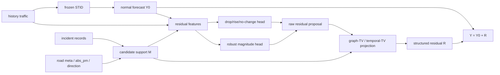

# Residual Learning Research Flow

**Date**: 2026-05-29

**Question**: after `DecayKernel` loses to a simple `BiasOnly` correction, what
does the literature suggest for learning accident-aware residuals more
principledly?

**Current evidence**:

- `DecayKernel` uses type / distance / direction / relative time features to
  regress raw residuals, but is worse than pure `STID` on every four-county
  event slice.
- `BiasOnly` ignores all kernel details and only applies a county-level mean
  residual on kernel-hit records. It is much closer to `STID`, and wins on some
  LosAngeles / ContraCosta event slices.
- Therefore, the first failure is not merely a bad \(\lambda\). The missing
  piece is deciding whether an incident-node-horizon triple should produce a
  positive correction, a negative correction, or no correction.

## Literature Signals

| Thread | Main Message | Implication For This Project |
| --- | --- | --- |
| Residual Correction in Real-Time Traffic Forecasting, CIKM 2022 | Traffic models fail in event-like rapid speed drops; errors are autocorrelated and can be corrected using previous errors plus graph signals. | Residuals are not independent noise. Before learning from accident metadata, test whether STID residuals have temporal / graph autocorrelation around incidents. |
| Residual Correlation in Graph Neural Network Regression, KDD 2020 | A standard GNN predicts node labels independently after representation learning; residuals can still be graph-correlated. Modeling residual covariance improves regression. | Treat residuals as a graph signal with covariance / propagation structure, not as independent node-horizon samples. |
| Correct and Smooth, ICLR 2021 | A simple model plus graph error propagation and prediction smoothing can match strong GNNs. | A post-hoc residual propagation step is a legitimate baseline, not a hack. It should be compared before adding a large neural router. |
| Graph Signal Processing overview, IEEE SPM 2013 | Graph data can be processed through graph spectral domains, filters, localized transforms, and multiscale analysis. | Accident residuals can be analyzed by graph frequency: low-frequency bias, local mid/high-frequency incident response, and noisy high-frequency sensor error should be separated. |
| Discrete Signal Processing on Graphs, TSP 2014 | Graph total variation gives a way to order graph frequencies; adjacency-based graph shifts naturally handle directed graphs. | For road traffic, directed upstream/downstream shifts are more natural than only symmetric Laplacians. |
| Graph Trend Filtering, JMLR 2016 | Penalizing \(\ell_1\) graph differences gives locally adaptive, piecewise-smooth graph estimates beyond ordinary \(\ell_2\) smoothers. | Accident residuals are likely local and piecewise smooth, not globally smooth. Use graph-TV / trend filtering instead of only Laplacian smoothing. |
| GLOSS / low-rank plus temporally smooth sparse decomposition | Urban traffic anomalies can be modeled as sparse, temporally continuous residual components on top of a normal low-rank background. | Let `STID` model normal traffic, and constrain accident residuals to be sparse, local, and temporally persistent. |
| Functional gradient boosting / residual-like networks | A residual block can be viewed as a functional gradient step; the target depends on the loss, not always raw \(y-\hat y\). | Because we evaluate MAE, the first residual learning target should be the correction direction / pseudo-gradient, not raw residual magnitude. |

## Diagnosis Of The Failed Decay Kernel

The current post-hoc ridge model is:

$$
\hat{Y}_{h,i}
=
\hat{Y}^{0}_{h,i}
+
f_{\theta}
\left(
c_m,\ s_{i,m},\ \tau_{h,m}
\right)
$$

where \(f_\theta\) is trained on raw residuals:

$$
e_{h,i}=Y_{h,i}-\hat{Y}^{0}_{h,i}.
$$

This makes four assumptions that are probably too strong:

1. **Raw residual is the right target**. For MAE, the loss-aware target is closer
   to residual sign than residual magnitude.
2. **Incident kernel is a predictor**. Our results suggest it is only a
   candidate selector.
3. **Residual samples are independent**. Graph residual literature suggests the
   residual field may have spatial correlation.
4. **Smoothness is homogeneous**. Accident effects should be local and
   piecewise-smooth; global smoothing or unconstrained ridge can both be wrong.

## Principle 1: Learn The Loss-Aware Residual Direction

For a base forecaster:

$$
\hat{Y}^{0}=f_{\mathrm{STID}}(X),
$$

we add a small correction:

$$
\hat{Y}=\hat{Y}^{0}+\eta R_{\theta}(X,E).
$$

If the metric is squared error, the negative functional gradient is:

$$
r^{\mathrm{MSE}}
=
Y-\hat{Y}^{0}.
$$

But for MAE:

$$
\mathcal{L}_{\mathrm{MAE}}
=
\left|Y-\hat{Y}\right|,
$$

the useful correction direction is:

$$
r^{\mathrm{MAE}}
=
-
\frac{\partial \mathcal{L}_{\mathrm{MAE}}}{\partial \hat{Y}^{0}}
=
\mathrm{sign}
\left(
Y-\hat{Y}^{0}
\right).
$$

So a better first module is not:

$$
R_{\theta}\approx Y-\hat{Y}^{0}.
$$

It is:

$$
z_{h,i}
\in
\{\mathrm{drop},\ \mathrm{rise},\ \mathrm{no\ change}\},
$$

followed by a conservative magnitude:

$$
R_{h,i}
=
\mathbb{I}(z_{h,i}=\mathrm{rise})a^{+}_{h,i}
-
\mathbb{I}(z_{h,i}=\mathrm{drop})a^{-}_{h,i}.
$$

Practical pilot:

- train a sign classifier on calibration residuals;
- only apply correction when confidence exceeds a validation threshold;
- use BiasOnly or robust median magnitude as the first magnitude head;
- report sign accuracy, activation precision, and MAE delta.

## Principle 2: Residuals Are Graph Signals

Let \(R_h\in\mathbb{R}^{N}\) be the residual over nodes at horizon \(h\). A
graph signal processing view asks whether:

$$
R_h
$$

has structure under a graph shift \(S\), graph Laplacian \(L\), or directed
road propagation matrix \(P\).

Before training a new model, compute:

$$
\mathrm{GTV}(R_h)
=
\sum_{(i,j)\in\mathcal{E}}
w_{ij}
\left|
R_{h,i}-R_{h,j}
\right|,
$$

and a residual graph autocorrelation score:

$$
\rho_h
=
\frac{
R_h^{\top} P R_h
}{
R_h^{\top} R_h+\epsilon
}.
$$

If \(\rho_h\) is not positive on event slices, graph propagation is unlikely to
help. If \(\rho_h\) is positive only on specific directions or event types, the
router should be type/direction-specific.

## Principle 3: Use Graph Trend Filtering, Not Plain Smoothness

Plain Laplacian smoothing assumes neighboring residuals should be close
everywhere:

$$
\Omega_{\ell_2}(R)
=
R^{\top} L R.
$$

That is risky for accidents because incident influence may have a sharp boundary
between affected and unaffected road segments. Graph trend filtering instead
uses sparse graph differences:

$$
\Omega_{\mathrm{GTV}}(R)
=
\|BR\|_1,
$$

where \(B\) is a graph incidence / difference operator. This encourages local
piecewise smoothness while allowing sharp boundaries.

For traffic events, a useful post-hoc residual estimate is:

$$
R^{\star}
=
\arg\min_R
\frac{1}{2}
\left\|
R-\tilde{R}_{\theta}
\right\|_2^2
+
\lambda_g
\left\|
B R
\right\|_1
+
\lambda_t
\left\|
D_t R
\right\|_1
+
\lambda_0
\left\|
(1-M)\odot R
\right\|_2^2.
$$

Here:

- \(\tilde{R}_{\theta}\) is the raw residual proposal;
- \(B\) encodes directed or undirected road-neighbor differences;
- \(D_t\) encodes horizon-wise temporal differences;
- \(M\) is the incident candidate mask from type / distance / time rules.

This changes the role of the incident kernel:

$$
\text{kernel} \Rightarrow \text{support prior},
$$

not:

$$
\text{kernel} \Rightarrow \text{residual value}.
$$

## Principle 4: Separate Background Bias From Incident Response

Low-rank plus sparse anomaly decomposition suggests:

$$
Y
=
Y_{\mathrm{normal}}
+
Y_{\mathrm{event}}
+
\epsilon.
$$

In this project:

$$
\hat{Y}^{0}_{\mathrm{STID}}
\approx
Y_{\mathrm{normal}}.
$$

The accident residual should satisfy:

$$
Y_{\mathrm{event}}
\text{ is sparse in node-time support}
$$

and:

$$
D_tY_{\mathrm{event}}
\text{ is sparse / temporally persistent}.
$$

This is consistent with post-last traffic degradation: accident influence is
not a single spike; it can persist for multiple horizons, but only locally.

## Candidate V3: Gradient-Guided Graph Trend Residual Corrector

Working name:

```text
G3TRC: Gradient-Guided Graph Trend Residual Corrector
```

### Data Flow



### Formula

First estimate correction direction:

$$
p_{h,i}
=
\mathrm{softmax}
\left(
f_{\theta}(Z_{h,i})
\right),
$$

where:

$$
p_{h,i}
=
\left[
p^{\mathrm{drop}}_{h,i},
p^{\mathrm{rise}}_{h,i},
p^{\mathrm{none}}_{h,i}
\right].
$$

Then propose a signed residual:

$$
\tilde{R}_{h,i}
=
g_{h,i}
\left(
p^{\mathrm{rise}}_{h,i}
-
p^{\mathrm{drop}}_{h,i}
\right)
a_{\theta}(Z_{h,i}),
$$

where:

$$
g_{h,i}
=
\mathbb{I}
\left[
\max(p_{h,i})>\kappa
\right]
\cdot
M_{h,i}.
$$

Finally project the residual proposal into a graph/temporal structured field:

$$
R^{\star}
=
\arg\min_R
\frac{1}{2}
\left\|
R-\tilde{R}
\right\|_2^2
+
\lambda_g\|BR\|_1
+
\lambda_t\|D_tR\|_1
+
\lambda_0\|(1-M)\odot R\|_2^2.
$$

Prediction:

$$
\hat{Y}
=
\hat{Y}^{0}_{\mathrm{STID}}
+
R^{\star}.
$$

## Minimal Validation Plan

Do not start with a full BasicTS trainable module. Use saved STID
`test_results` first.

### Pilot A: Residual Structure Audit

Compute on calibration and evaluation halves:

- residual sign distribution by county / incident type / relation / horizon;
- graph autocorrelation \(\rho_h\);
- graph total variation ratio between event and no-event slices;
- spectral energy ratio if eigendecomposition is feasible on county subgraphs.

Success signal:

```text
event slices have stronger residual graph/temporal structure than no-event
slices.
```

### Pilot B: Loss-Aware Sign Residual

Compare:

| Method | Meaning |
| --- | --- |
| `STID` | hard baseline |
| `BiasOnly` | scalar residual sanity check |
| `DecayKernel` | current typed/distance/time ridge residual |
| `SignOnly` | predicts drop/rise/no-change, uses robust magnitude |
| `Sign+Reliability` | only corrects when validation reliability is high |

Success signal:

```text
Sign+Reliability beats BiasOnly on future_any / future_onset / post_last in
at least 3/4 counties.
```

### Pilot C: Graph-TV Projection

Apply graph-TV / temporal-TV projection to the raw sign residual:

$$
\tilde{R}
\rightarrow
R^{\star}.
$$

Success signal:

```text
Graph-TV improves event slices without increasing no_event MAE.
```

## Decision Rules

| Observation | Decision |
| --- | --- |
| Sign accuracy is near random | Mean residual learning is probably not viable; pivot to uncertainty / interval forecasting. |
| BiasOnly remains strongest | The current event metadata only supports local calibration, not rich impact prediction. |
| Sign helps but Graph-TV does not | Keep residual classifier; skip GSP projection. |
| Graph autocorrelation is strong and Graph-TV helps | Implement G3TRC as the next BasicTS module. |
| Gains occur only in one county | Treat as county-specific adaptation, not a general accident-aware method claim. |

## Recommended Next Step

Implement a post-hoc `traffident_sign_gsp_residual_pilot.py` with three stages:

1. residual structure audit;
2. sign-aware residual correction with reliability gating;
3. optional graph-TV projection on the candidate support.

This is the smallest experiment that can distinguish three hypotheses:

$$
H_1:
\text{ accident metadata contains useful residual direction information;}
$$

$$
H_2:
\text{ residuals are graph/temporal structured after incidents;}
$$

$$
H_3:
\text{ event-aware mean correction is too weak, so the paper should pivot to risk/uncertainty.}
$$

Implementation status, 2026-05-29:

```text
reproduction/analysis/traffident_sign_gsp_residual_pilot.py
```

The first implementation keeps the protocol post-hoc: it reuses saved pure
`STID` `test_results`, constructs the same incident candidate support as the
decay-kernel pilot, fits a loss-aware sign ridge model on the calibration split,
tunes a reliability threshold on a held-out calibration slice, and writes:

- `residual_structure_audit.csv`
- `sign_gsp_metrics.csv`
- `sign_gsp_summary.csv`

The implemented comparison set is:

```text
STID vs BiasOnly vs DecayKernel vs SignReliability
```

### 2026-05-29 Four-County G3TRC Post-Hoc Pilot

Server output:

```text
reproduction/analysis/traffident_sign_gsp_residual_pilot_4county_dist05_t6_12
```

The four-county run completed, but the validation-selected gate chose:

```text
threshold = 0.0
scale = 0.0
```

So `SignReliability` became a no-op and exactly matched `STID`. This is a
negative result: with the current feature set and ridge sign model, the safest
validation choice is not to apply any sign residual correction.

Metric summary:

| Slice | BiasOnly Delta | DecayKernel Delta | SignReliability Delta |
| --- | ---: | ---: | ---: |
| `all_eval` | +0.0003 | +0.0013 | +0.0000 |
| `future_any` | +0.0128 | +0.1190 | +0.0000 |
| `future_onset` | +0.0118 | +0.1186 | +0.0000 |
| `post_last_slot` | +0.0152 | +0.1119 | +0.0000 |
| `ongoing` | +0.0214 | +0.1236 | +0.0000 |

Residual-structure audit:

- Temporal autocorrelation is consistently non-trivial:
  - no-event is about `0.50-0.56`;
  - event slices are also about `0.42-0.62`.
- This does not show that event residuals have stronger temporal structure than
  normal residuals; it mostly says STID residuals are temporally persistent in
  general.
- Graph autocorrelation is weak or inconsistent on key future-event slices:
  - LosAngeles `future_any`: `-0.0356`;
  - Orange `future_any`: `-0.3345`;
  - Alameda `future_any`: `-0.0297`;
  - ContraCosta `future_any`: `-0.0843`.
- `post_last_slot` has a local graph signal in some counties, e.g.
  LosAngeles `0.1117` and Orange `0.9964`, but not consistently across counties.

Decision:

```text
Do not implement graph-TV projection yet.
The current sign model is not reliable enough to provide a useful residual
proposal, and the graph autocorrelation evidence is not broadly positive on
future-event slices.
```

Next recommended direction:

1. audit whether the target should be residual sign, residual quantile, or risk
   inflation rather than mean correction;
2. add stronger candidate labels from matched controls before trying another
   residual predictor;
3. consider pivoting the main claim toward uncertainty / tail-risk under
   incidents if mean correction keeps collapsing to no-op.

## Sources

- Residual Correction in Real-Time Traffic Forecasting, CIKM 2022:
  https://arxiv.org/abs/2209.05406
- Residual Correlation in Graph Neural Network Regression, KDD 2020:
  https://arxiv.org/abs/2002.08274
- Combining Label Propagation and Simple Models Out-performs Graph Neural
  Networks, ICLR 2021: https://arxiv.org/abs/2010.13993
- The Emerging Field of Signal Processing on Graphs, IEEE SPM 2013:
  https://arxiv.org/abs/1211.0053
- Discrete Signal Processing on Graphs, IEEE TSP 2014:
  https://users.ece.cmu.edu/~asandryh/papers/tsp14.pdf
- Trend Filtering on Graphs, JMLR 2016:
  https://jmlr.csail.mit.edu/papers/v17/15-147.html
- GLOSS / low-rank plus temporally smooth sparse decomposition:
  https://arxiv.org/abs/2010.12633
- Functional Gradient Boosting for Learning Residual-like Networks with
  Statistical Guarantees, AISTATS 2020:
  https://proceedings.mlr.press/v108/nitanda20a.html
