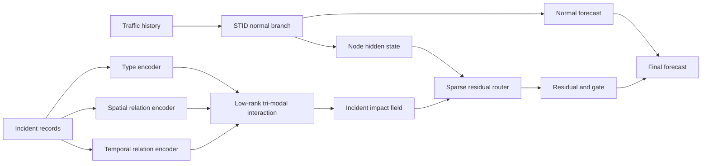

# V2 Tri-Modal Incident Field Router

**Status**: ARIS method proposal, not implemented yet  
**Goal**: replace ad-hoc future accident embedding with a literature-grounded,
modality-factorized incident impact module.  
**Hard baseline**: pure `STID`.

## Problem Anchor

Previous pilots show that direct accident embedding and the oracle future binary
router are too crude. Accident type, spatial relation, and temporal relation are
not the same kind of information:

- accident type is semantic / categorical;
- spatial distance is geometric and directional;
- time distance is event-relative and asymmetric before vs after onset.

The method should model an incident as an impact field over node-horizon pairs,
not as a global covariate attached to a traffic window.

## Literature Grounding

| Source | Useful Evidence | Design Implication |
| --- | --- | --- |
| TraffiDent, NeurIPS 2025 D&B | Traffic and incidents are spatiotemporally aligned; seven incident classes and road meta-attributes are available; post-incident forecasting is explicitly proposed. | Use TraffiDent incident type, Abs PM, direction, road meta, and event-window metrics instead of generic traffic metrics only. |
| TraffiDent local causal analysis | A `1141` case changes lagged causal road relations after the incident, and congestion propagates to nearby/upstream roads. | Model incident-to-node propagation, not only the matched node. |
| MM-DAG, KDD 2023 | Traffic systems contain heterogeneous variables: scalars, vectors, and functions. | Treat type, space, and time as separate modalities before fusion. |
| IGSTGNN, arXiv 2026 | Incident-Context Spatial Fusion and Temporal Incident Impact Decay explicitly separate spatial influence and temporal dissipation. | Spatial influence and temporal decay should be separate modules. |
| EGAF-Net, Information Sciences 2023 | Uses spatial event embedding, dynamic event graph construction, temporal event attention, and gated fusion. | Event-aware traffic forecasting needs event-specific spatial and temporal representations, not simple event concatenation. |
| DMGNN, ESWA 2023 | Accident information changes local spatial dependency and motivates accident-related adjacency / dynamic graph adjustment. | Use incident-conditioned dynamic propagation masks. |
| STGNPP, AAAI 2023 / TGN | Sparse traffic events are naturally modeled with event time, duration, and temporal graph mechanisms. | Use relative time-to-event / time-since-event rather than plain horizon index. |

## Method Thesis

Learn a sparse residual field on top of a normal-traffic STID forecast by
factorizing each incident's semantic type, spatial relation, and temporal
relation, then composing them into node-horizon-specific impact scores.

## Prediction Form

Freeze or warm-start a pure STID branch:

$$
\hat{Y}^{0}_{h,i} = f_{\mathrm{STID}}(X_{t-L+1:t})
$$

The incident module predicts only a residual:

$$
\hat{Y}_{h,i}
=
\hat{Y}^{0}_{h,i}
+
G_{h,i}\Delta_{h,i}
$$

where \(G_{h,i}\) is sparse and should be nonzero only when a plausible incident
impact exists for node \(i\) at forecast horizon \(h\).

## Incident-to-Node-Horizon Triples

For each incident \(m\), construct a candidate relation to target node \(i\)
and horizon \(h\):

$$
r_{h,i,m}
=
\left(c_m,\ s_{i,m},\ \tau_{h,m}\right)
$$

where:

- \(c_m\): incident semantic information, e.g. type, injury class, lane closure
  if available;
- \(s_{i,m}\): spatial relation from incident \(m\) to sensor \(i\);
- \(\tau_{h,m}\): relative event time between horizon \(h\) and incident onset.

## Modality Encoders

### 1. Type Encoder

$$
u_m = \phi_c(c_m)
$$

Examples:

$$
c_m = [\mathrm{type},\ \mathrm{injury},\ \mathrm{severity},\ \mathrm{duration}]
$$

The initial TraffiDent signal suggests `1141` should be handled separately
because it is the most consistent positive slice in the oracle run.

### 2. Spatial Relation Encoder

Use road-aware distance and direction, not only nearest-node matching:

$$
s_{i,m}
=
\left[
d^{\mathrm{road}}_{i,m},
d^{\mathrm{absPM}}_{i,m},
\mathbb{I}(\mathrm{same\ fwy}),
\mathbb{I}(\mathrm{upstream}),
\mathbb{I}(\mathrm{downstream})
\right]
$$

Then encode with radial basis features plus direction embeddings:

$$
v_{i,m}
=
\phi_s(s_{i,m})
=
\left[
\exp\left(-\frac{(d^{\mathrm{road}}_{i,m}-\mu_k)^2}{2\sigma_k^2}\right)
\right]_{k=1}^{K}
\oplus
E_{\mathrm{dir}}(\rho_{i,m})
$$

where:

$$
\rho_{i,m} \in \{\mathrm{upstream},\mathrm{downstream},\mathrm{source}\}
$$

### 3. Temporal Relation Encoder

Let \(t_h\) be the absolute time of forecast horizon \(h\), and \(o_m\) be the
incident onset time:

$$
\delta_{h,m}=t_h-o_m
$$

Use event-relative features:

$$
\tau_{h,m}
=
\left[
\mathbb{I}(\delta_{h,m}<0),
\mathbb{I}(\delta_{h,m}=0),
\mathbb{I}(\delta_{h,m}>0),
|\delta_{h,m}|,
\max(\delta_{h,m},0),
\max(-\delta_{h,m},0)
\right]
$$

Then:

$$
w_{h,m}=\phi_t(\tau_{h,m})
$$

A useful inductive bias is asymmetric decay:

$$
k_t(\delta)
=
\mathbb{I}(\delta \ge 0)
\sum_{r=1}^{R}\alpha_r \exp\left(-\frac{\delta}{\lambda_r^+}\right)
+
\mathbb{I}(\delta < 0)
\sum_{r=1}^{R}\beta_r \exp\left(-\frac{-\delta}{\lambda_r^-}\right)
$$

This separates post-incident dissipation from pre-incident anticipation.

## Tri-Modal Fusion

Do not concatenate all features and hope the MLP discovers structure. Use a
low-rank tri-modal interaction:

$$
q_{h,i,m}
=
\left\langle
W_c u_m,\,
W_s v_{i,m},\,
W_t w_{h,m}
\right\rangle
$$

Equivalently:

$$
q_{h,i,m}
=
\mathbf{1}^{\top}
\left[
(W_cu_m)\odot(W_sv_{i,m})\odot(W_tw_{h,m})
\right]
$$

This score means:

> how strongly incident \(m\), with type \(c_m\), should affect node \(i\) at
> horizon \(h\), given spatial and temporal relation.

## Incident Field Aggregation

For each node-horizon pair, aggregate only plausible nearby incidents:

$$
\mathcal{M}_{h,i}
=
\left\{
m:
d^{\mathrm{road}}_{i,m}<D,\ 
|\delta_{h,m}|<T
\right\}
$$

The incident impact field is:

$$
F_{h,i}
=
\sum_{m\in\mathcal{M}_{h,i}}
\alpha_{h,i,m}\,
\psi(u_m,v_{i,m},w_{h,m})
$$

where:

$$
\alpha_{h,i,m}
=
\frac{\exp(q_{h,i,m})}
{\sum_{m'\in\mathcal{M}_{h,i}}\exp(q_{h,i,m'})}
$$

If \(\mathcal{M}_{h,i}\) is empty, set \(F_{h,i}=0\), making the module fall
back to pure STID.

## Sparse Residual Router

Let \(Z_i\) be the STID hidden state for node \(i\). The residual and gate are:

$$
G_{h,i}
=
\sigma\left(f_g([Z_i,F_{h,i},\eta_i])\right)
$$

$$
\Delta_{h,i}
=
f_{\Delta}([Z_i,F_{h,i},\eta_i])
$$

where \(\eta_i\) contains static road meta-features if available.

To handle asymmetric incident effects:

$$
\Delta_{h,i}
=
\pi^{\mathrm{drop}}_{h,i}\Delta^{\mathrm{drop}}_{h,i}
+
\pi^{\mathrm{rise}}_{h,i}\Delta^{\mathrm{rise}}_{h,i}
+
\pi^{\mathrm{neutral}}_{h,i}\Delta^{\mathrm{neutral}}_{h,i}
$$

This is motivated by current statistics: post-incident windows are not always
underestimated; some affected nodes show rise rather than drop.

## Architecture



## Training Plan

Stage 1: frozen-STID residual oracle.

$$
Y^{\mathrm{res}}_{h,i}=Y_{h,i}-\hat{Y}^{0}_{h,i}
$$

Train only the incident field router:

$$
\mathcal{L}
=
\mathcal{L}_{\mathrm{all}}
+
\lambda_e\mathcal{L}_{\mathrm{event}}
+
\lambda_s\|G\|_1
+
\lambda_o\mathcal{L}_{\mathrm{outside}}
$$

where:

$$
\mathcal{L}_{\mathrm{event}}
=
\frac{1}{|\Omega_e|}
\sum_{(h,i)\in\Omega_e}
\left|
Y_{h,i}-\hat{Y}_{h,i}
\right|
$$

and:

$$
\mathcal{L}_{\mathrm{outside}}
=
\sum_{(h,i): \mathcal{M}_{h,i}=\emptyset}
G_{h,i}
$$

Stage 2: unfreeze STID with a small learning rate only if Stage 1 beats pure
STID on event-sensitive slices.

## Evaluation

Primary success criteria:

| Slice | Required Signal |
| --- | --- |
| `post_last_slot` | mean delta vs STID < 0 and wins >= 3/4 counties |
| `ongoing` | mean delta vs STID < 0 and wins >= 3/4 counties |
| `future_onset` oracle | mean delta vs STID < 0, proving future timing can help |
| `incident_type=1141` | robust improvement; this is the strongest current slice |
| `downstream` | robust improvement; current post-last signal is positive |

Required ablations:

| Ablation | Purpose |
| --- | --- |
| remove type encoder | test whether semantic accident type matters |
| remove spatial relation encoder | test whether distance/direction matters |
| remove temporal relation encoder | test whether event-relative timing matters |
| concat-only fusion | test whether tri-modal low-rank interaction matters |
| matched-node only | test whether propagation beyond matched node matters |
| no sparsity / no outside penalty | test whether router is merely overfitting |

## Novelty Check

Closest prior work:

| Prior | Overlap | Gap |
| --- | --- | --- |
| IGSTGNN | separates incident spatial context and temporal decay | does not explicitly factor type, spatial relation, and relative event time as three modalities over incident-node-horizon triples |
| EGAF-Net | event spatial embedding, temporal event attention, gated fusion | focuses on event-aware speed prediction; fusion is less explicitly residual and less tied to accident type / road-distance / time-distance factorization |
| DMGNN | accident-related adjacency and dynamic graph adjustment | accident influence is represented as graph adjustment, not as typed temporal incident impact fields |
| TraffiDent analysis | establishes dataset, event classes, post-incident forecasting, MM-DAG/PCMCI analysis | does not propose a forecasting model that operationalizes these multimodal relations |
| STGNPP / TGN | event time and dynamic graph mechanisms | predicts events or dynamic graph embeddings, not accident-induced residual traffic forecasting |

Preliminary novelty score: **7/10**.

The method is not novel because it uses gates, residuals, attention, or dynamic
graphs. The novelty would come from the specific decomposition:

$$
\mathrm{incident\ impact}
=
f(\mathrm{type},\mathrm{spatial\ relation},\mathrm{relative\ event\ time})
$$

over incident-to-node-horizon triples, trained as a sparse residual field on
top of a strong normal traffic forecaster.

## Immediate Next Step

Before full BasicTS implementation, do a low-cost post-hoc pilot:

1. use saved pure STID predictions;
2. build incident-node-horizon triples from `matched_incidents.csv` and
   `sensor_meta_feature.csv`;
3. train only the residual router on train/val predictions;
4. test whether type + space + relative-time features beat:
   - STID;
   - current oracle binary future router;
   - concat-only feature fusion.

If this post-hoc pilot fails, do not implement the full model yet; first fix
event matching radius or incident impact labels.

Implemented pilot script:

```text
reproduction/analysis/traffident_decay_kernel_pilot.py
```

This first trial keeps decay scales as hyperparameters:

$$
K_{h,i,m}
=
\exp\left(-\frac{|d_{i,m}|}{\lambda_s}\right)
\cdot
\begin{cases}
\exp\left(-\frac{\delta_{h,m}}{\lambda_t^+}\right), & \delta_{h,m}\ge 0 \\
\exp\left(\frac{\delta_{h,m}}{\lambda_t^-}\right), & \delta_{h,m}<0
\end{cases}
$$

Then it uses typed / directional kernel features in a ridge residual model. This
is intentionally simpler than the full V2 architecture, so the first question is
only whether an explicit distance-decay prior has positive signal.

### 2026-05-29 First Decay-Kernel Pilot

Server output:

```text
reproduction/analysis/traffident_decay_kernel_pilot_4county_dist05_t6_12_samedir_alpha1000_clip5
```

Setting:

```text
max_distance = 0.5 mile
max_pre_slots = 6
max_post_slots = 12
same_direction_only = true
ridge_alpha = 1000
clip_residual = 5
lambda_space = 1.0
lambda_time_post = 6
lambda_time_pre = 3
```

Four-county summary:

| Slice | Mean Delta vs STID MAE | Wins |
| --- | ---: | ---: |
| `all_eval` | +0.0013 | 0/4 |
| `kernel_candidate` | +0.0955 | 0/4 |
| `future_any` | +0.1190 | 0/4 |
| `future_onset` | +0.1186 | 0/4 |
| `history_any` | +0.0550 | 0/4 |
| `history_only` | +0.0472 | 0/4 |
| `post_last_slot` | +0.1119 | 0/4 |
| `ongoing` | +0.1236 | 1/4 |

Bias diagnostic:

| County / Slice | STID Bias | DecayKernel Bias | MAE Delta |
| --- | ---: | ---: | ---: |
| LosAngeles `future_any` | -1.5105 | -1.2959 | +0.1283 |
| Orange `future_any` | -1.1146 | -1.3846 | +0.1121 |
| Alameda `future_any` | -2.3545 | -1.4047 | +0.1932 |
| ContraCosta `future_any` | +0.5630 | +0.2435 | +0.0425 |
| ContraCosta `ongoing` | +1.6534 | +1.5777 | -0.0097 |

Interpretation:

- The simple exponential kernel does not beat pure `STID`.
- The kernel mainly shifts bias toward zero, but this does not translate to MAE
  improvement.
- The bias pattern is not even consistent across counties: Alameda benefits in
  mean bias but loses MAE, while Orange moves bias in the wrong direction on
  `future_any`.
- This suggests the current kernel identifies plausible affected records, but
  the residual sign and magnitude are unreliable at the sample level.
- The only local win is ContraCosta `ongoing` with `-0.0097` MAE, too small and
  isolated to support the method.
- Therefore, distance decay alone is not enough; the next version should not
  simply tune \(\lambda\). It should revise the residual target/gate and add
  stronger supervision for when the correction should be positive, negative, or
  inactive.

Decision:

```text
Do not implement the full BasicTS V2 yet.
First improve the post-hoc objective:
1. learn sign-aware drop/rise residual heads;
2. gate by validation-estimated residual reliability, not just incident kernel;
3. compare against a no-residual bias-only correction;
4. only then return to trainable BasicTS integration.
```

### 2026-05-29 BiasOnly Sanity Check

Server output:

```text
reproduction/analysis/traffident_decay_kernel_pilot_4county_dist05_t6_12_samedir_alpha1000_clip5_biasonly
```

This rerun adds a `BiasOnly` correction: for each county, estimate the weighted
mean residual on kernel-hit calibration records, then apply that scalar residual
to kernel-hit evaluation records. It deliberately ignores type, distance,
direction, and relative time details.

Four-county comparison:

| Slice | DecayKernel Delta | BiasOnly Delta | Decay Wins | BiasOnly Wins |
| --- | ---: | ---: | ---: | ---: |
| `all_eval` | +0.0013 | +0.0003 | 0/4 | 1/4 |
| `kernel_candidate` | +0.0955 | +0.0220 | 0/4 | 1/4 |
| `future_any` | +0.1190 | +0.0128 | 0/4 | 2/4 |
| `future_onset` | +0.1186 | +0.0118 | 0/4 | 2/4 |
| `history_any` | +0.0550 | +0.0103 | 0/4 | 2/4 |
| `history_only` | +0.0472 | +0.0090 | 0/4 | 2/4 |
| `post_last_slot` | +0.1119 | +0.0152 | 0/4 | 2/4 |
| `ongoing` | +0.1236 | +0.0214 | 1/4 | 2/4 |

County-level examples:

| County / Slice | DecayKernel Delta | BiasOnly Delta |
| --- | ---: | ---: |
| LosAngeles `future_any` | +0.1283 | -0.0013 |
| LosAngeles `ongoing` | +0.1033 | -0.0102 |
| LosAngeles `post_last_slot` | +0.1203 | -0.0061 |
| Alameda `future_any` | +0.1932 | +0.0465 |
| ContraCosta `future_any` | +0.0425 | -0.0020 |
| ContraCosta `post_last_slot` | +0.0637 | -0.0033 |

Interpretation:

- `BiasOnly` is much closer to `STID` than `DecayKernel` on every event slice.
- `BiasOnly` gets small wins on LosAngeles and ContraCosta event slices where
  `DecayKernel` is clearly worse.
- Therefore the current typed/directional/time-decay feature details do not yet
  add useful predictive structure beyond a simple local bias correction.
- The problem is not just choosing a better \(\lambda\). The harder missing part
  is deciding whether each incident-node-horizon triple should produce a
  positive correction, a negative correction, or no correction.

Updated decision:

```text
Treat the current decay kernel as a candidate selector, not as a residual
predictor. The next low-cost step should model residual direction explicitly:
1. estimate drop/rise/no-change labels from calibration residuals;
2. train separate positive and negative residual heads;
3. use a reliability gate learned from validation records;
4. keep BiasOnly as a required sanity baseline.
```

## References

- TraffiDent: https://arxiv.org/abs/2407.11477
- MM-DAG: https://arxiv.org/abs/2306.02831
- IGSTGNN: https://arxiv.org/abs/2602.02528
- EGAF-Net: https://doi.org/10.1016/j.ins.2022.11.168
- DMGNN: https://doi.org/10.1016/j.eswa.2023.121101
- STGNPP: https://doi.org/10.1609/aaai.v37i12.26669
- TGN: https://arxiv.org/abs/2006.10637
