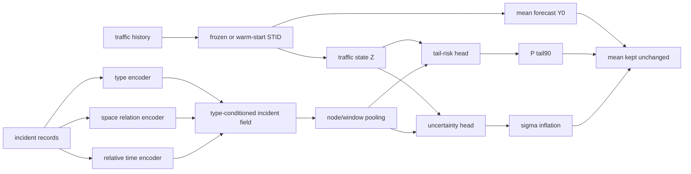

# V3 Type-Conditioned Incident Risk Forecaster

**Status**: ARIS method proposal, not implemented yet  
**Goal**: use incident information to predict risk / uncertainty under
incidents, rather than forcing a mean residual correction.  
**Hard baseline**: pure `STID`.

## Target

Previous pilots show that accident-aware mean correction is unstable:

- `DecayKernel` is worse than pure `STID`;
- `BiasOnly` is safer than the decay kernel but still weak;
- `SignReliability` collapses to a no-op under validation;
- matched-control type slicing shows that only `UnknInj` consistently raises
  STID MAE and tail90 risk.

Therefore the next target should not be:

$$
\hat{Y}_{h,i}
=
\hat{Y}^{0}_{h,i}
+
\Delta_{h,i}
$$

The next target is incident-conditioned risk:

$$
\pi_{r,i}
=
P
\left(
E_{r,i} > q^{(c)}_{0.9}
\mid
X_r,\mathcal{I}_r
\right)
$$

where \(E_{r,i}\) is the STID error for sample window \(r\), node \(i\), and
\(q^{(c)}_{0.9}\) is the county-specific no-event tail threshold.

## Status

COHERENT AFTER REFRAMING.

The object changes from conditional mean forecasting to conditional tail-risk
forecasting. This is supported by the matched-control audit: incident labels
change the error distribution more consistently than they improve mean
prediction.

## Invariant Object

The invariant object is the conditional risk of STID failure:

$$
T_{r,i}
=
\mathbb{I}
\left(
E_{r,i} > q^{(c)}_{0.9}
\right)
$$

with:

$$
E_{r,i}
=
\frac{1}{H}
\sum_{h=1}^{H}
\left|
Y_{r,h,i}
-
\hat{Y}^{0}_{r,h,i}
\right|
$$

The model predicts \(T_{r,i}\) or a calibrated proxy for it. It does not need to
change the STID mean forecast in the first version.

## Assumptions

- A pure STID model provides the normal-traffic mean prediction
  \(\hat{Y}^{0}\).
- No-event controls define the reference error distribution for each county.
- Incident type matters: `UnknInj`, `NoInj`, and `1141` should not share one
  undifferentiated accident embedding.
- Incident spatial / temporal kernels are candidate support priors, not direct
  residual magnitudes.
- The first deployable model should avoid future traffic leakage. Future
  incident labels are allowed only for oracle analysis or explicitly marked
  oracle variants.

## Notation

- \(r\): prediction sample window.
- \(i\): target sensor node.
- \(h \in \{1,\ldots,H\}\): forecast horizon.
- \(c\): county.
- \(m\): incident record.
- \(\mathcal{I}_r\): incident records visible to sample \(r\).
- \(\hat{Y}^{0}_{r,h,i}\): pure STID prediction.
- \(Y_{r,h,i}\): ground-truth traffic target.
- \(E_{r,i}\): mean absolute STID error across horizons.
- \(T_{r,i}\): tail90 failure label.
- \(q^{(c)}_{0.9}\): 90th percentile of \(E_{r,i}\) over no-event controls.

## Tail Label

For each county \(c\), compute:

$$
q^{(c)}_{0.9}
=
\mathrm{Quantile}_{0.9}
\left(
\left\{
E_{r,i}
:
(r,i)\in\mathcal{C}^{(c)}_{\mathrm{no\text{-}event}}
\right\}
\right)
$$

Then define:

$$
T_{r,i}
=
\mathbb{I}
\left(
E_{r,i} > q^{(c)}_{0.9}
\right)
$$

This gives a binary target for whether STID enters its no-event top-10% error
tail.

## Type-Conditioned Incident Field

For each candidate incident \(m\), construct:

$$
z_{h,i,m}
=
\left[
e_{\mathrm{type}}(c_m),
\phi_s(s_{i,m}),
\phi_t(\delta_{h,m})
\right]
$$

where:

$$
\delta_{h,m}=t_{r,h}-o_m
$$

\(o_m\) is incident onset / report time, \(s_{i,m}\) is the incident-node
spatial relation, and \(c_m\) is the incident type.

Use the spatial-temporal kernel only as a support prior:

$$
K_{h,i,m}
=
\exp
\left(
-\frac{d_{i,m}}{\lambda_s}
\right)
\cdot
\left[
\mathbb{I}(\delta_{h,m}\ge0)
\exp
\left(
-\frac{\delta_{h,m}}{\lambda_t^+}
\right)
+
\mathbb{I}(\delta_{h,m}<0)
\exp
\left(
-\frac{-\delta_{h,m}}{\lambda_t^-}
\right)
\right]
$$

Aggregate:

$$
F_{r,h,i}
=
\sum_{m\in\mathcal{I}_r}
K_{h,i,m}
\psi(z_{h,i,m})
$$

The type prior should be initialized or regularized according to the audit:

$$
b_{\mathrm{UnknInj}}>0,\quad
b_{\mathrm{NoInj}}\approx 0,\quad
b_{1141}\le 0
$$

This is not a hard rule. It is a weak prior reflecting the observed tail-risk
direction.

## Risk Head

Let \(Z_{r,i}\) be the STID hidden state or a frozen summary of recent traffic.
The risk head predicts:

$$
\pi_{r,i}
=
\sigma
\left(
f_{\theta}
\left(
Z_{r,i},
\mathrm{Pool}_{h}(F_{r,h,i}),
\eta_{r,i}
\right)
\right)
$$

where \(\eta_{r,i}\) can include time-of-day, day-of-week, county, and normal
traffic volatility features.

The primary loss is weighted binary cross entropy:

$$
\mathcal{L}_{\mathrm{risk}}
=
-
\alpha T_{r,i}\log \pi_{r,i}
-
(1-T_{r,i})\log(1-\pi_{r,i})
$$

Because tail90 positives are sparse, \(\alpha\) should be chosen from the
training positive rate or replaced by focal loss:

$$
\mathcal{L}_{\mathrm{focal}}
=
-
\alpha
T_{r,i}
(1-\pi_{r,i})^\gamma
\log \pi_{r,i}
-
(1-T_{r,i})
\pi_{r,i}^{\gamma}
\log(1-\pi_{r,i})
$$

## Optional Uncertainty Head

A second head can predict uncertainty inflation instead of changing the mean:

$$
\log \sigma_{r,i}
=
\log \sigma^{0}_{r,i}
+
g_{\theta}
\left(
Z_{r,i},
\mathrm{Pool}_{h}(F_{r,h,i})
\right)
$$

where \(\sigma^{0}_{r,i}\) is the no-event calibrated STID error scale. A
prediction interval is:

$$
\left[
\hat{Y}^{0}_{r,h,i}
-
z_{\alpha}\sigma_{r,i},
\hat{Y}^{0}_{r,h,i}
+
z_{\alpha}\sigma_{r,i}
\right]
$$

This version should be evaluated by coverage, interval width, ECE, Brier score,
AUROC, and AUPRC, not only MAE.

## No-Mean-Correction Rule

The first version should keep:

$$
\hat{Y}_{r,h,i}
=
\hat{Y}^{0}_{r,h,i}
$$

and only output:

$$
\pi_{r,i},\quad \sigma_{r,i}
$$

Mean correction may be reintroduced only after risk calibration is positive:

$$
\hat{Y}_{r,h,i}
=
\hat{Y}^{0}_{r,h,i}
+
\mathbb{I}(\pi_{r,i}>\tau)
\Delta_{r,h,i}
$$

This prevents the module from repeating the failure mode of previous residual
pilots.

## Architecture



## Pilot Plan

1. Build a post-hoc risk dataset from saved pure-STID `test_results`.
2. Train a lightweight classifier for \(T_{r,i}\) using type-conditioned event
   field features plus normal traffic volatility features.
3. Compare against:
   - no-event base rate;
   - county base rate;
   - type-only logistic regression;
   - decay-kernel score;
   - STID residual magnitude proxy.
4. Report AUROC, AUPRC, Brier, ECE, and recall at fixed false-positive rate.
5. Only if calibration is positive, implement a BasicTS module.

## Success Criteria

Minimum success:

$$
\mathrm{AUPRC}_{\mathrm{type+risk}}
>
\mathrm{AUPRC}_{\mathrm{county\ base}}
$$

and:

$$
\mathrm{ECE}_{\mathrm{type+risk}}
<
\mathrm{ECE}_{\mathrm{type\ only}}
$$

Stronger success:

$$
P(T=1\mid\pi>\tau)
-
P(T=1)
>0
$$

on `UnknInj` event slices across at least three counties.

## Non-Claims

- This does not claim to improve mean MAE.
- This does not claim a causal accident effect.
- This does not claim `1141` is harmless; it only says `1141` does not behave
  like the current positive tail-risk class under the four-county Q1 audit.
- This does not yet solve incident-node mapping. Spatial relation quality still
  matters for any deployable model.

## Decision

The next low-cost experiment should be a post-hoc type-conditioned tail-risk
pilot. If that pilot fails, the accident labels in the current benchmark are
probably insufficient for a robust forecasting improvement claim, and the main
paper direction should return to dataset analysis or stronger event alignment.

## 2026-06-01 Four-County Post-Hoc Pilot

Implementation:

```text
reproduction/analysis/traffident_type_risk_pilot.py
```

Server outputs:

```text
reproduction/analysis/traffident_type_risk_pilot_4county_history_future_samedir
reproduction/analysis/traffident_type_risk_pilot_4county_history_samedir
```

Models compared:

| Model | Features |
| --- | --- |
| `county_base` | county tail90 base rate |
| `type_only` | county + incident type features |
| `traffic_time` | history traffic statistics + time features |
| `incident_field` | incident type / space / time kernel features |
| `v3_type_risk` | traffic/time + incident field |

Key result:

```text
The risk prediction signal is dominated by history traffic and time features.
The incident field alone has little standalone ranking power.
V3 mainly improves calibration / Brier score on some incident slices, but does
not robustly improve AUROC/AUPRC over the traffic_time ablation.
```

History-future oracle scope:

| Slice | Model | AUROC | AUPRC | Brier | ECE |
| --- | --- | ---: | ---: | ---: | ---: |
| `future_any` | `traffic_time` | 0.9110 | 0.5588 | 0.1364 | 0.2119 |
| `future_any` | `incident_field` | 0.5075 | 0.1292 | 0.1312 | 0.1356 |
| `future_any` | `v3_type_risk` | 0.9072 | 0.5549 | 0.0902 | 0.0976 |
| `UnknInj/future_any` | `traffic_time` | 0.9297 | 0.5856 | 0.1200 | 0.1964 |
| `UnknInj/future_any` | `incident_field` | 0.4341 | 0.1027 | 0.1268 | 0.1373 |
| `UnknInj/future_any` | `v3_type_risk` | 0.9252 | 0.5770 | 0.0802 | 0.0911 |

History-only deployable scope:

| Slice | Model | AUROC | AUPRC | Brier | ECE |
| --- | --- | ---: | ---: | ---: | ---: |
| `future_any` | `traffic_time` | 0.9110 | 0.5588 | 0.1364 | 0.2119 |
| `future_any` | `incident_field` | 0.4892 | 0.1287 | 0.2362 | 0.3471 |
| `future_any` | `v3_type_risk` | 0.9066 | 0.5504 | 0.1337 | 0.2032 |
| `UnknInj/future_any` | `traffic_time` | 0.9297 | 0.5856 | 0.1200 | 0.1964 |
| `UnknInj/future_any` | `incident_field` | 0.4946 | 0.1223 | 0.2368 | 0.3574 |
| `UnknInj/future_any` | `v3_type_risk` | 0.9260 | 0.5776 | 0.1182 | 0.1892 |
| `UnknInj/ongoing` | `traffic_time` | 0.9357 | 0.6286 | 0.1068 | 0.1800 |
| `UnknInj/ongoing` | `incident_field` | 0.4848 | 0.1823 | 0.1323 | 0.1266 |
| `UnknInj/ongoing` | `v3_type_risk` | 0.9399 | 0.6393 | 0.0714 | 0.0903 |

Interpretation:

- `traffic_time` is a very strong risk predictor even on `no_event_sample`, so
  much of tail90 risk is normal traffic difficulty rather than incident-specific
  information.
- `incident_field` does not yet carry enough independent signal. It is near
  random or worse on most future slices.
- `v3_type_risk` improves Brier / ECE in several event slices, especially under
  oracle `history_future`, but its ranking metrics mostly track or trail
  `traffic_time`.
- The only deployable local positive signal is `UnknInj/ongoing`, where
  `v3_type_risk` slightly improves AUROC/AUPRC and clearly improves calibration
  versus `traffic_time`.

Decision:

```text
Do not implement V3 as a BasicTS module yet.
The next step should audit whether incident labels add incremental information
after conditioning on traffic_time, or whether the project should focus on
traffic-state risk calibration plus incident-conditioned analysis.
```

## Incremental Incident Value Check

After conditioning on the strong `traffic_time` baseline, compute:

$$
\Delta_{\mathrm{rank}}
=
\mathrm{Metric}
\left(
\mathrm{v3\_type\_risk}
\right)
-
\mathrm{Metric}
\left(
\mathrm{traffic\_time}
\right)
$$

where higher is better for AUROC, AUPRC, and top10 lift, while lower is better
for Brier and ECE.

Strict positive criterion:

$$
\Delta \mathrm{AUROC}>0,\quad
\Delta \mathrm{AUPRC}>0,\quad
\Delta \mathrm{top10\_lift}>0,\quad
\Delta \mathrm{Brier}<0,\quad
\Delta \mathrm{ECE}<0
$$

Only `UnknInj/ongoing` satisfies this criterion in both scopes:

| Scope | Slice | Delta AUROC | Delta AUPRC | Delta top10 lift | Delta Brier | Delta ECE |
| --- | --- | ---: | ---: | ---: | ---: | ---: |
| `history_future` | `UnknInj/ongoing` | +0.0015 | +0.0056 | +0.0115 | -0.0356 | -0.0859 |
| `history` | `UnknInj/ongoing` | +0.0042 | +0.0107 | +0.0343 | -0.0354 | -0.0897 |

For future-event slices, V3 often improves calibration but not ranking:

| Scope | Slice | Delta AUROC | Delta AUPRC | Delta top10 lift | Delta Brier | Delta ECE |
| --- | --- | ---: | ---: | ---: | ---: | ---: |
| `history_future` | `future_any` | -0.0038 | -0.0038 | -0.0103 | -0.0462 | -0.1143 |
| `history_future` | `UnknInj/future_any` | -0.0045 | -0.0086 | -0.0211 | -0.0398 | -0.1053 |
| `history` | `future_any` | -0.0044 | -0.0084 | -0.0119 | -0.0027 | -0.0087 |
| `history` | `UnknInj/future_any` | -0.0037 | -0.0080 | -0.0127 | -0.0018 | -0.0072 |

Interpretation:

```text
Incident features add calibration value, but not stable ranking value, after
traffic_time is known. The only robust incremental slice is UnknInj/ongoing.
```

This suggests the next useful target is not a general incident-aware risk
forecaster. A sharper next step is either:

1. model `UnknInj/ongoing` as a narrow case study;
2. treat incident labels as calibration modifiers for a traffic-state risk
   model;
3. improve incident-node/time alignment before trying another forecasting
   module.
