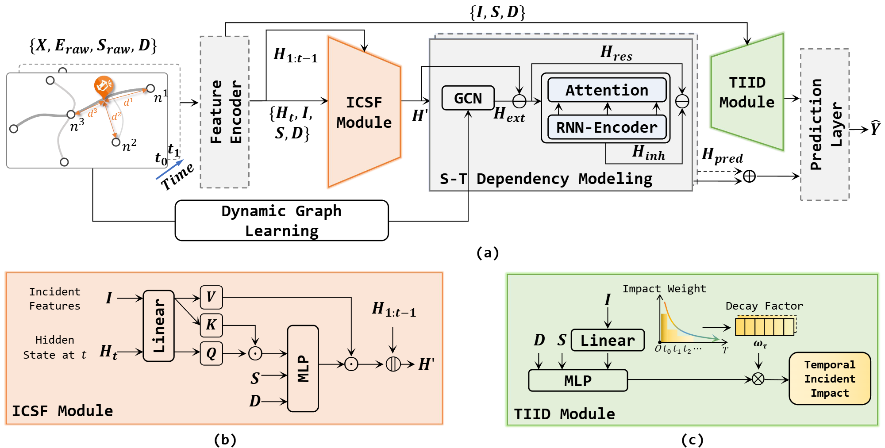
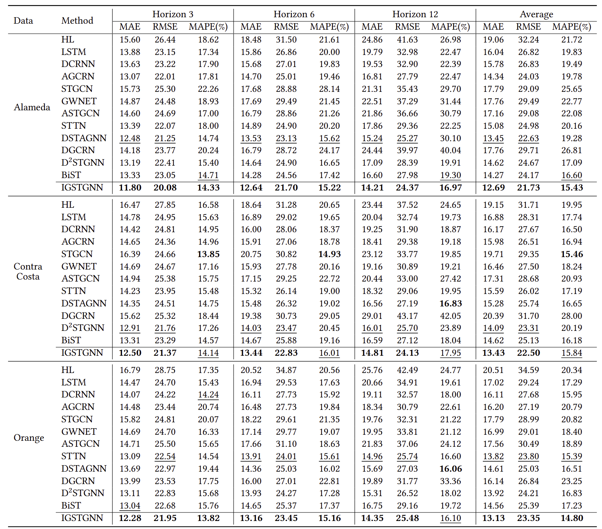
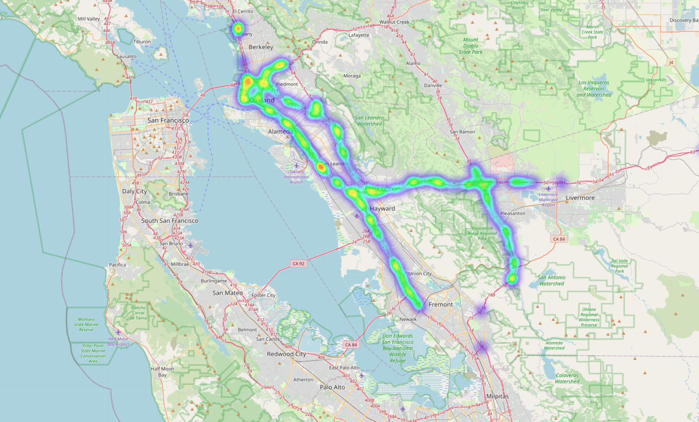
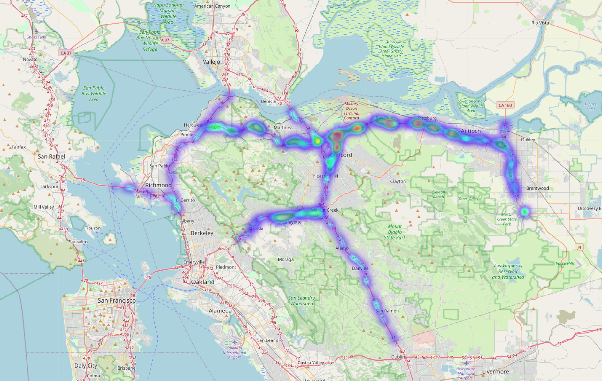
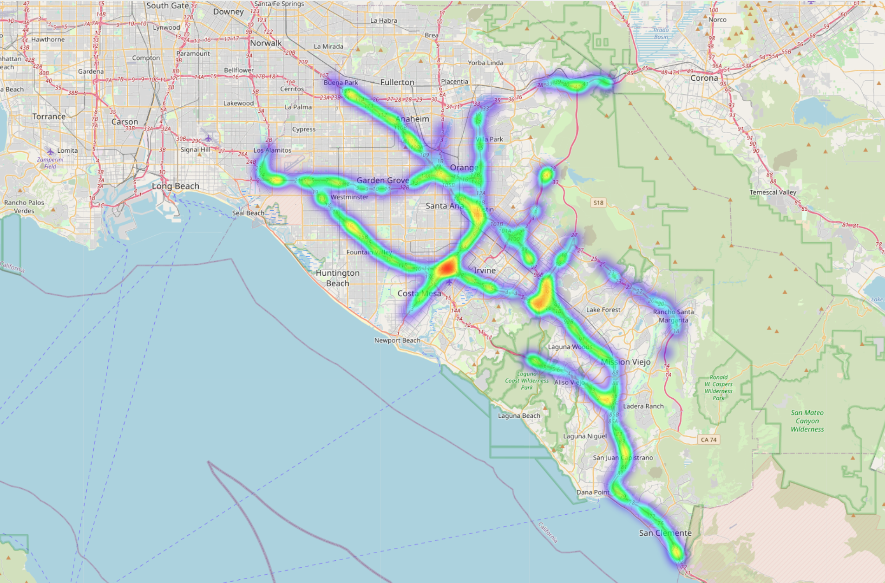

# IGSTGNN: Incident-Guided Spatiotemporal Traffic Forecasting

This repository contains the official implementation of **IGSTGNN (Incident-Guided Spatiotemporal Graph Neural Network)** for incident-aware traffic forecasting. IGSTGNN injects incident context into spatiotemporal traffic modeling and explicitly captures heterogeneous spatial influence and temporal impact decay.

## Overview

Most spatiotemporal forecasting models learn from historical traffic time series alone. Non-recurrent incidents, such as crashes or road hazards, can introduce abrupt distribution shifts that are difficult to infer from history. IGSTGNN addresses this problem by fusing incident attributes, sensor metadata, traffic states, and graph structure for multi-step traffic forecasting.

## Framework



IGSTGNN consists of three main components:

- **Incident-Context Spatial Fusion (ICSF)**: fuses incident attributes, sensor meta-features, and current traffic states with incident-sensor spatial relationships.
- **Spatiotemporal forecasting backbone**: captures traffic dynamics over the road sensor graph.
- **Temporal Incident Impact Decay (TIID)**: refines forecasts by modeling how incident impact decays across the prediction horizon.

## Results



## Dataset

The model-ready datasets are released separately on Kaggle. This repository does not include raw data, data-construction code, generated splits, checkpoints, or local experiment outputs.

- **Kaggle**: [Data for IGSTGNN](https://www.kaggle.com/datasets/lixiangfan/data4igstgnn)

After downloading the dataset, place each city directory under `data/xtraffic/`:

```text
data/
└── xtraffic/
    ├── Alameda/
    ├── Contra_Costa/
    └── Orange/
```

Each city directory should contain:

```text
adj_matrix.npy
desc_mapping.json
incident_all.npy
incident_stats.npz
sensors.csv
type_mapping.json
```

The released `incident_all.npy` files contain the full normalized sample sets. Generate the split files expected by the existing dataloader with:

```bash
python data/xtraffic/prepare_splits.py --dataset Alameda
python data/xtraffic/prepare_splits.py --dataset Contra_Costa
python data/xtraffic/prepare_splits.py --dataset Orange
```

This creates:

```text
incident_train.npy
incident_val.npy
incident_test.npy
```

The split script is deterministic by default: 70% training, 15% validation, and 15% testing. It does not reshuffle or renormalize samples; it only slices `incident_all.npy` into the three files used by training, validation, and testing.

Supported dataset names are `Alameda`, `Contra_Costa`, and `Orange`.

## Project Structure

```text
IGSTGNN/
├── data/
│   └── xtraffic/
│       ├── README.md
│       └── prepare_splits.py
├── experiments/
│   └── IGSTGNN/
│       ├── main.py
│       └── run.sh
├── img/
│   ├── framework.png
│   ├── performance.png
│   └── Incidents_heatmap/
├── src/
│   ├── base/
│   ├── engines/
│   ├── models/
│   └── utils/
├── LICENSE
├── README.md
└── requirements.txt
```

## Quick Start

### Environment

Create and activate a Conda environment, then install the pinned dependencies:

```bash
conda create -n igstgnn python=3.10 pip -y
conda activate igstgnn
python -m pip install -r requirements.txt
```

Python 3.10 or 3.11 is recommended. The pinned stack is not tested on Python 3.12 or newer.

### Prepare Data

Download the Kaggle dataset and place the city folders under `data/xtraffic/`, then run the split script for the city you want to use. For example:

```bash
python data/xtraffic/prepare_splits.py --dataset Alameda
```

### Training

Train IGSTGNN with incident information and sensor metadata enabled. If CUDA is unavailable, replace `--device cuda:0` with `--device cpu`; CPU training will be slower.

```bash
python experiments/IGSTGNN/main.py \
  --device cuda:0 \
  --dataset Alameda \
  --model_name igstgnn \
  --seed 2025 \
  --bs 48 \
  --incident \
  --use_sensor_info
```

For the other released datasets, replace `Alameda` with `Contra_Costa` or `Orange`.

### Preset Script

Run the provided experiment preset:

```bash
bash experiments/IGSTGNN/run.sh
```

## Input Features

The model uses historical traffic time series plus two contextual sources:

- **Sensor meta-features**: roadway and sensor attributes such as road type, speed limit, surface, and roadway use.
- **Incident information**: incident type, description, relative timing, spatial position, and incident-sensor distance features stored in each sample.

## Visualization

Incident distribution heatmaps:







## License

This project is licensed under the MIT License. See [LICENSE](LICENSE) for details.

## Citation

If you find this work useful, please cite:

```bibtex
@inproceedings{DBLP:conf/kdd/FanLZYD26,
  author       = {Lixiang Fan and
                  Bohao Li and
                  Tao Zou and
                  Junchen Ye and
                  Bowen Du},
  editor       = {Srinivasan Parthasarathy and
                  David F. Gleich and
                  Xiangliang Zhang and
                  Wee Hyong Tok and
                  Faisal Farooq and
                  Qi He and
                  Ambuj K. Singh and
                  Haixun Wang and
                  Yan Liu},
  title        = {Incident-Guided Spatiotemporal Traffic Forecasting},
  booktitle    = {Proceedings of the 32nd {ACM} {SIGKDD} Conference on Knowledge Discovery
                  and Data Mining V.1, {KDD} 2026, Jeju Island, Korea, August 9-13,
                  2026},
  pages        = {243--254},
  publisher    = {{ACM}},
  year         = {2026},
  url          = {https://doi.org/10.1145/3770854.3780215},
  doi          = {10.1145/3770854.3780215},
  biburl       = {https://dblp.org/rec/conf/kdd/FanLZYD26.bib},
  bibsource    = {dblp computer science bibliography, https://dblp.org}
}
```
